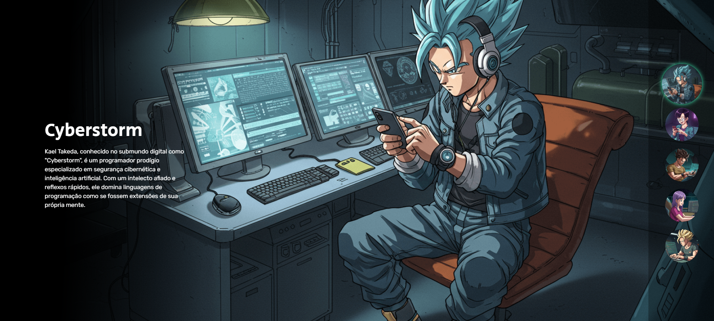
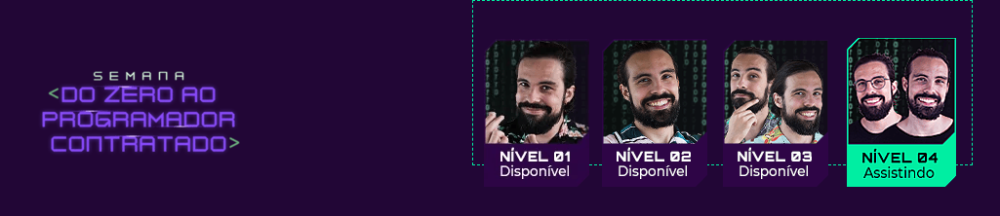

  

<h1 align="center">Projeto Dragon Ball </h1>

Uma imersão épica de 7 dias com os irmãos Dev em Dobro! 🐉

  <a href="#-tecnologias">Tecnologias</a>&nbsp;&nbsp;&nbsp;|&nbsp;&nbsp;&nbsp;
  <a href="#-projeto">Projeto</a>

  

 

## 🚀 Tecnologias

Esse projeto foi desenvolvido com as seguintes tecnologias:

- HTML
- CSS
- JavaScript
- Git e Github
- IA - Inteligência Artificial

 

## 💻 Projeto

A Semana Do Zero Ao Programador Contratado é um projeto imersivo de uma semana, criado pelos irmãos Dev em Dobro, onde você aprende os fundamentos de HTML, CSS e JavaScript de forma prática e divertida!

Durante essa jornada, você vai construir uma aplicação completa, cheia de efeitos, interações e referências ao anime, enquanto aprende:

- Fundamentos sólidos de HTML, CSS e JavaScript

- Clean Code: Escrevendo código limpo, organizado e fácil de manter

- Introdução a Inteligência Artificial no front-end

- Dicas valiosas de produtividade e carreira no desenvolvimento

 

  

 

<h2 align="center">🤝 Colaboradores </h2>

<table align="center">
  <tr>
    <td align="center">
      <a href="https://github.com/rebellatoGui" title="GitHub">
         
        
          <b>Guilherme Rebellato</b>
        
      </a>
    </td>
  </tr>
</table>

 

---

<b>Feito com ♥ por Dev Em Dobro<b>

  

